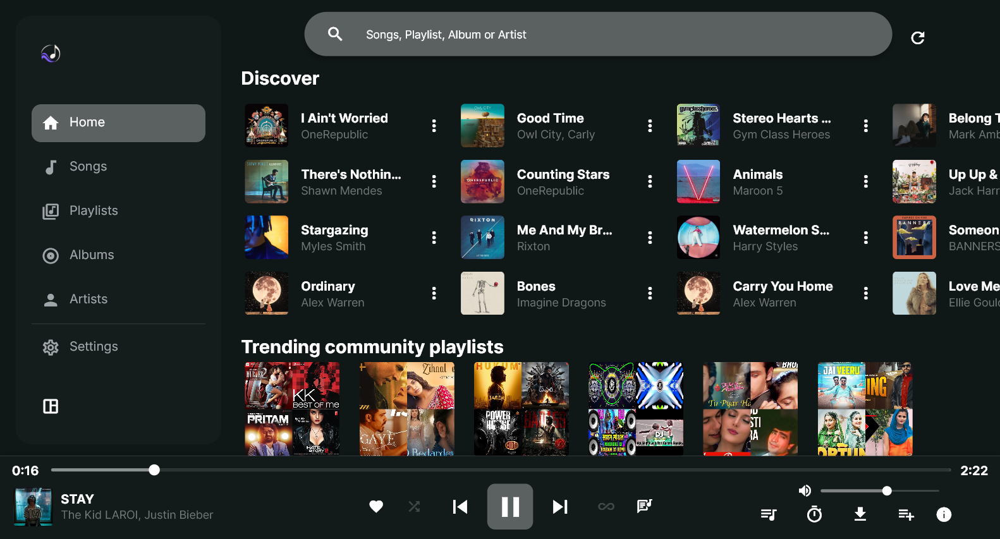
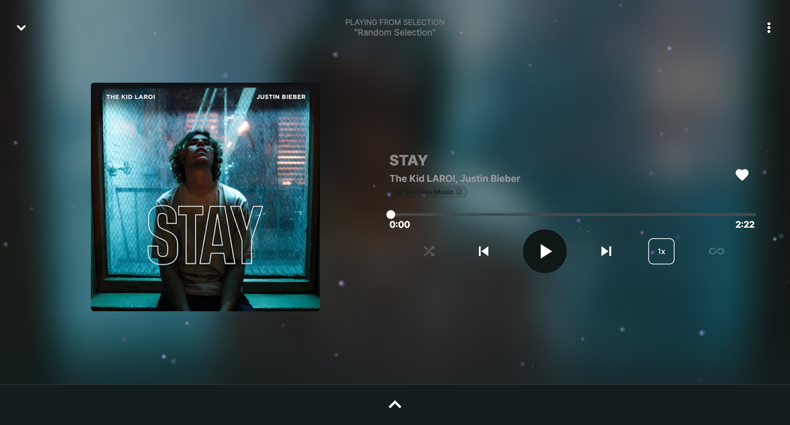
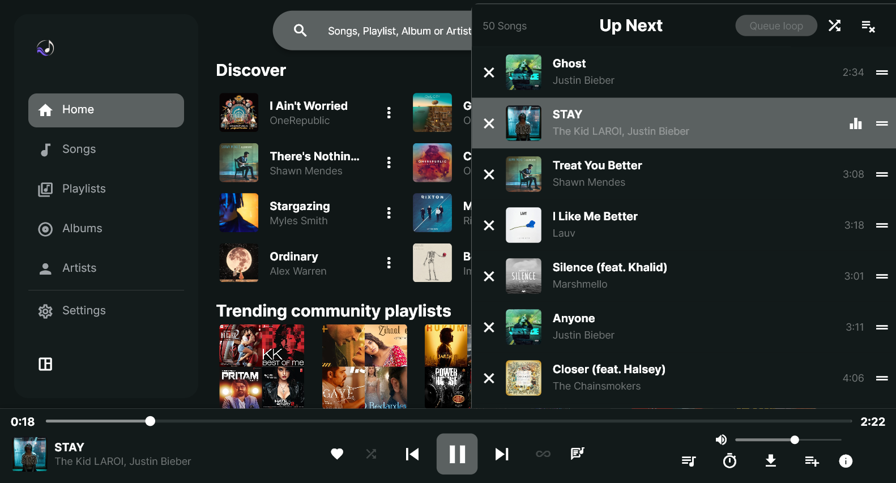
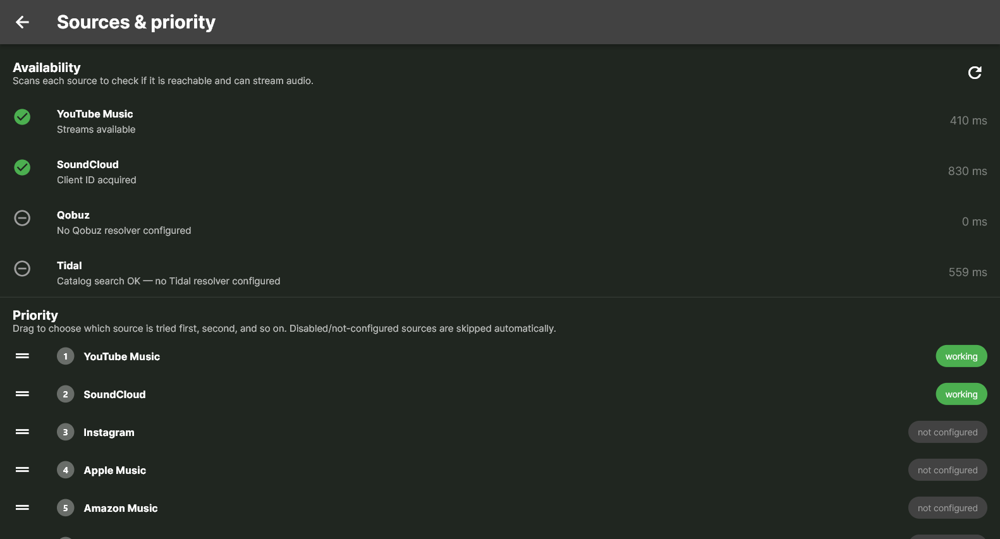
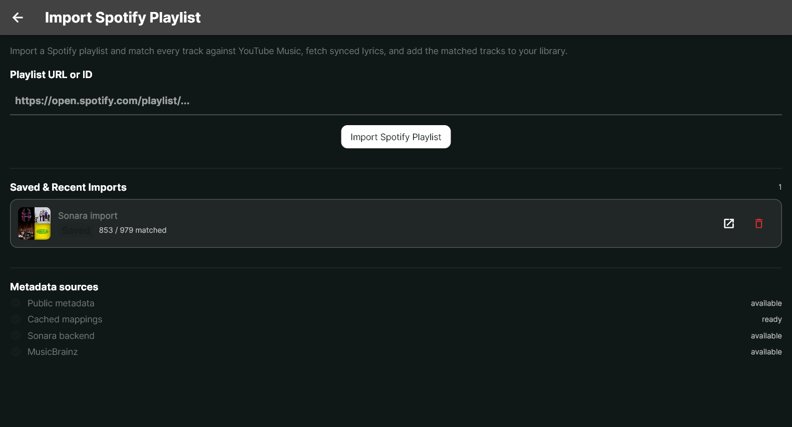
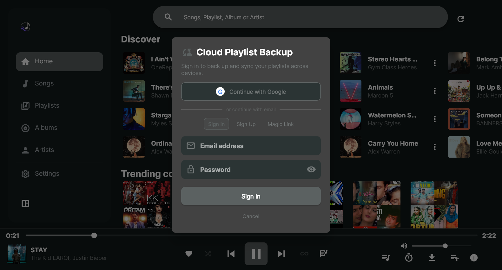
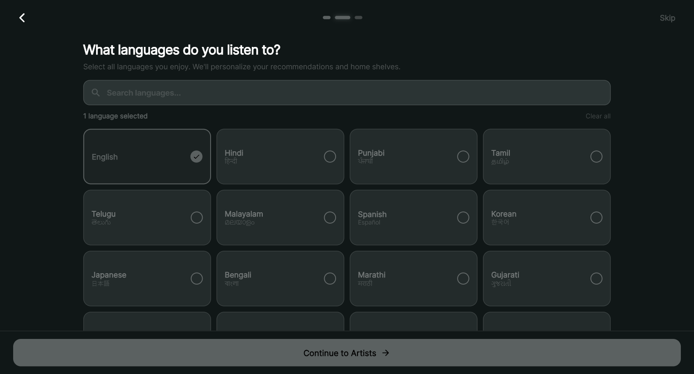
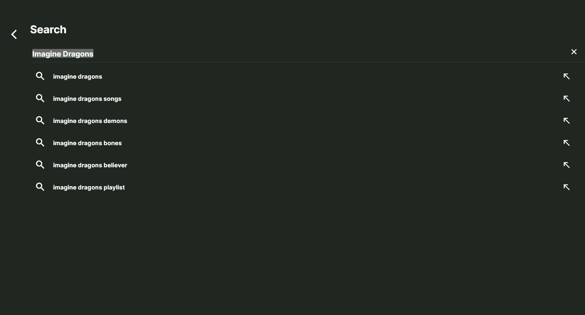

<div align="center">

# Sonara

**A cross-platform music streaming and discovery application engineered with Flutter, unifying playback, playlist management, and catalog resolution across multiple music sources behind a single coherent experience.**

[](https://flutter.dev)
[](https://dart.dev)
[](LICENSE)
[](https://github.com/StretchWave/Sonara)

</div>

Sonara addresses digital music fragmentation across disparate streaming platforms, community audio hubs, and specialized lossless archives. Rather than forcing users to juggle multiple vendor-specific applications, Sonara introduces a provider-agnostic audio routing architecture. The user interface interacts strictly with normalized metadata models, while a tiered fallback resolver dynamically fetches, fuzzy-scores, and streams tracks from YouTube Music, SoundCloud, and optional community or self-hosted lossless endpoints (such as Qobuz or Tidal resolver instances) without requiring user accounts or hardcoded credentials.

The application is built offline-first using Hive for persistent caching, offers optional two-way cloud synchronization and authentication via Supabase, supports public Spotify playlist migration with automated lyrics and metadata enrichment, and provides personalized recommendations based on playback frequency and multilingual preferences.

---

## Screenshots

| Home & Discovery | Now Playing Player |
| :---: | :---: |
|  |  |
| *Personalized discovery shelves, trending playlists, and responsive player controls* | *Expanded player with ambient backdrop, synchronized lyrics, and format details* |

| Queue Management | Audio Sources & Priority |
| :---: | :---: |
|  |  |
| *Desktop slide-out queue with live track reordering and queue loop modes* | *Multi-source latency diagnostics and custom fallback priority ordering* |

| Spotify Playlist Import | Cloud Backup & Authentication |
| :---: | :---: |
|  |  |
| *URL-based playlist migration, fuzzy track matching, and metadata enrichment* | *Optional Supabase cloud synchronization with Email, Google, and Magic Link* |

| Multilingual Recommendations | Music Discovery & Search |
| :---: | :---: |
|  |  |
| *Multilingual preference setup for regional and artist seed generation* | *Real-time catalog search with instant suggestions and history indexing* |

---

## Key Features

- **Unified Music Discovery**: Browse dynamic shelves, community playlists, albums, and artist discographies from a single catalog interface.
- **Multi-Source Audio Routing**: Pluggable source abstraction supporting YouTube Music, SoundCloud, and optional lossless FLAC/AAC resolvers (Qobuz, Tidal) with live health scanning and configurable fallback priority.
- **Engineered Playback & Queue**: Continuous background audio playback, gapless transitions, skip silence, sleep timer, track seek bar, speed controls, and interactive queue management with reordering.
- **Synchronized Lyrics & Metadata Enrichment**: Time-synced and plain lyrics resolved automatically through LRCLIB, augmented with MusicBrainz release metadata and ISRC resolution.
- **Spotify Playlist Ingestion**: Import public Spotify playlists via URL or ID, automatically cross-matching tracks against streamable catalogs using weighted fuzzy scoring.
- **Offline-First Persistence**: High-throughput local storage using Hive boxes (`SongsCache`, `SongDownloads`, `AppPrefs`), ensuring instantaneous startup and 100% offline usability.
- **Optional Supabase Cloud Sync**: Non-blocking user authentication (Email/Password, Magic Link, Google OAuth) with background two-way playlist synchronization and timestamp-based conflict resolution.
- **Taste & Recommendation Engine**: Algorithmic song recommendation combining liked songs, play-count metrics (`PlaybackStatsService`), favorite artists, and music languages.
- **Adaptive Responsive UI**: Tailored layouts supporting mobile bottom navigation, desktop animated sidebars, dynamic color theme extraction, and AMOLED dark modes.

---

## Tech Stack

| Layer | Technologies | Purpose in Sonara |
| :--- | :--- | :--- |
| **Framework & UI** | Flutter, Dart | Declarative cross-platform application interface for mobile and desktop |
| **State Management** | GetX (`GetxController`, `GetxService`) | Reactive state management, dependency injection, and decoupled route handling |
| **Audio Core** | `just_audio`, `just_audio_media_kit`, `audio_service` | Platform audio handling: native Android audio pipeline and `libmpv` audio engine on Windows and Linux |
| **Local Storage** | Hive, `hive_flutter` | Lightweight NoSQL key-value database for caches, settings, session recovery, and offline downloads |
| **Cloud & Auth** | Supabase (`supabase_flutter`, PostgreSQL) | Optional user accounts, preferences persistence, and Row-Level Security (RLS) playlist synchronization |
| **Audio Sources** | `youtube_explode_dart`, internal scrapers | YouTube Music stream and navigation resolution |
| | Custom HTTP & bundle scrapers | SoundCloud progressive and HLS stream extraction via client-side token acquisition |
| | External resolver protocol | Optional community-hosted lossless resolvers (Qobuz, Tidal) |
| **Metadata & Lyrics** | LRCLIB API, MusicBrainz API | Synchronized lyrics timing, track normalization, and ISRC enrichment |

---

## Architecture

Sonara separates the user interface from catalog retrieval and streaming mechanisms through clean domain boundaries:

```
┌─────────────────────────────────────────────────────────────────┐
│                           UI Layer                              │
│   HomeScreen  •  Player  •  Queue  •  SpotifyImport  •  Settings│
└────────────────────────────────┬────────────────────────────────┘
                                 │ Observables & Controllers
┌────────────────────────────────▼────────────────────────────────┐
│                   Application & Services Layer                  │
│  PlayerController • RecommendationService • PlaylistSyncService │
│       AudioHandler (Background Playback & OS Media Controls)    │
└───────────────────────┬─────────────────────────────────────────┘
                        │ SongQuery
┌───────────────────────▼─────────────────────────────────────────┐
│                    Stream Routing & Matching                    │
│   StreamRouter  •  TrackMatcher  •  TrackScorer  •  RetryPolicy │
└───────────┬───────────────────────────────┬─────────────────────┘
            │                               │
┌───────────▼─────────────────────┐ ┌───────▼─────────────────────┐
│     Audio Source Providers      │ │      Persistence Layer      │
│ • YouTubeAudioProvider          │ │ • Hive (Local DB)           │
│ • SoundCloudAudioProvider       │ │   - SongsCache              │
│ • Qobuz / Tidal (Resolvers)     │ │   - AppPrefs & Downloads    │
│ • InternetArchiveProvider       │ │ • Supabase (Cloud Sync)     │
│ • LRCLIB & MusicBrainz APIs     │ │   - PostgreSQL with RLS     │
└─────────────────────────────────┘ └─────────────────────────────┘
```

### Decoupled Music Source Abstraction

The UI and playback engine never consume provider-specific models directly. Instead:
1. Every playable item is represented as a normalized `SongQuery` (title, artists, album, duration, ISRC).
2. The `StreamRouter` evaluates registered instances of `AudioSourceProvider` according to user-configured priority order.
3. Each provider attempts resolution and returns a typed `ProviderResult` containing a `ResolvedStream`, match confidence details, and latency telemetry.
4. If a source fails or is unconfigured, the router falls back down the chain until a playable stream is secured.

---

## Engineering Highlights

### 1. Cross-Catalog Track Matching & Scoring
Mapping tracks across distinct streaming platforms (e.g., matching a Spotify playlist item against YouTube Music or SoundCloud) requires handling noise such as feature annotations, remasters, and official video tags. Sonara implements `TrackMatcher` and `TrackScorer`:
- Normalizes titles by stripping parenthetical metadata (`(Official Video)`, `[Remastered 2021]`, `feat. ...`).
- Applies weighted string similarity across artist arrays.
- Enforces duration tolerance bounds (penalizing candidate matches deviating beyond ±5 seconds) to prevent selecting extended music videos or radio edits.

### 2. Provider-Agnostic Audio Routing & Failover
Audio resolution is executed as a resilient pipeline in `StreamRouter`:
- Providers declare capabilities (`isCatalogProvider`, `canVerifyExactRecording`).
- Latency and availability are actively tracked (`ProviderHealthChecker`).
- If an upstream endpoint throttles or fails, execution falls back instantly without breaking the active playlist queue or corrupting playback state.

### 3. Offline-First Cloud Synchronization
Sonara prioritizes local availability:
- All playlist mutations (creation, track additions, reordering) commit synchronously to the local Hive database first.
- When an active Supabase session is present, `PlaylistSyncService` triggers asynchronous background sync tasks.
- Conflicts are resolved using UTC `updated_at` timestamps (newest write wins).
- Signing out never flushes or destroys locally saved playlists.

### 4. Zero-Credential Audio Streaming
The application does not store or embed private streaming accounts or proprietary OAuth tokens:
- SoundCloud integration dynamically scrapes ephemeral client tokens from web script bundles.
- YouTube Music streams are extracted directly via public web client endpoints.
- Hi-Res FLAC sources operate via user-supplied external resolver instance URLs, isolating third-party authorization logic outside the client codebase.

### 5. Multi-Engine Desktop and Mobile Parity
To guarantee consistent media playback across operating systems:
- Android runs on native audio pipelines managed through `just_audio`.
- Windows and Linux desktop targets utilize `just_audio_media_kit` backed by bundled `libmpv` binaries, ensuring hardware-accelerated playback, MPRIS integration on Linux, and System Media Transport Controls (SMTC) integration on Windows.

---

## Project Status

- **Status**: Active personal project / open-source software.
- **Current Maturity**: Core functionality—including multi-source playback, playlist management, queue controls, Spotify ingestion, local caching, and cloud sync—is fully implemented and operational.
- **Known Limitations**:
  - Upstream web scrapers depend on public web client interfaces; changes by third-party platforms may occasionally require parser updates.
  - Lossless FLAC playback for Qobuz or Tidal requires access to reachable external resolver endpoints.
  - Spotify playlist import ingests metadata and cross-matches audio; it does not decrypt or stream directly from Spotify's proprietary DRM servers.

---

## Setup & Local Development

### Prerequisites

- [Flutter SDK](https://docs.flutter.dev/get-started/install) (version `>=3.1.5 <4.0.0`, stable channel)
- Dart SDK (bundled with Flutter)
- Platform-specific build tools:
  - **Windows**: Visual Studio 2022 with "Desktop development with C++" workload
  - **Linux**: `clang`, `cmake`, `ninja-build`, `pkg-config`, `libgtk-3-dev`, `libmpv-dev`
  - **Android**: Android Studio with Android SDK and NDK configured

### Installation

1. Clone the repository:
   ```bash
   git clone https://github.com/StretchWave/Sonara.git
   cd Sonara
   ```

2. Install project dependencies:
   ```bash
   flutter pub get
   ```

3. Run the application:
   ```bash
   # Windows Desktop
   flutter run -d windows

   # Android Device / Emulator
   flutter run -d android

   # Linux Desktop
   flutter run -d linux
   ```

---

## Configuration

Sonara functions 100% offline out-of-the-box with zero required external accounts. Optional cloud synchronization and resolver services can be configured as follows:

### 1. Supabase Cloud Sync (Optional)

To enable cloud backup for playlists and preferences:
1. Create a Supabase project at [supabase.com](https://supabase.com).
2. Execute the migration script located in [`supabase/schema.sql`](supabase/schema.sql) in your Supabase SQL Editor to establish the required tables and Row-Level Security (RLS) policies.
3. Configure your Supabase credentials in [`lib/main.dart`](lib/main.dart):
   ```dart
   await Supabase.initialize(
     url: 'YOUR_SUPABASE_URL',
     anonKey: 'YOUR_SUPABASE_ANON_KEY',
   );
   ```
   *(Ensure production deployments inject these values via `--dart-define` or secure configuration).*

### 2. Spotify Resolver Backend (Optional)

Public Spotify playlists can be imported client-side. To enhance ingestion throughput or bypass rate limits, an optional standalone server-side resolver is provided in the [`backend/`](backend/README.md) directory.

Build the client with the custom resolver backend:
```bash
flutter run -d windows --dart-define=BACKEND_URL=https://your-backend-instance.example.com
```

---

## Legal & Attribution

- **Independent Project**: Sonara is an independent software project and is not affiliated, sponsored, authorized, or endorsed by Spotify, YouTube, Google, SoundCloud, Qobuz, or Tidal.
- **Third-Party Content**: All song titles, artist names, album artwork, and audio streams are the intellectual property of their respective copyright holders.
- **Usage & Compliance**: Where third-party APIs or public endpoints are accessed, respective terms of service and usage guidelines apply. Sonara is intended for personal software research and learning purposes.

---

## Roadmap

The following enhancements are planned for future iterations:

- [ ] Support for local audio file library playback (local MP3/FLAC scanning).
- [ ] Direct export of matched playlists to external services via OAuth.
- [ ] Gapless cross-fade audio transition settings.
- [ ] Additional community resolver driver plugins.
- [ ] Android Auto interface refinements.

---

## License

Sonara is distributed under the **GNU General Public License v3.0** (see [`LICENSE`](LICENSE)).

As a derivative project originating from [Harmony Music](https://github.com/anandnet/Harmony-Music), it honors upstream conditions:
- Copies or modified versions of this software may not be used for closed-source or commercial profit purposes.
- Re-distribution on proprietary closed app repositories (e.g. Google Play Store or Apple App Store) is prohibited.

---

## Maintainer

**StretchWave**
- GitHub: [@StretchWave](https://github.com/StretchWave)
- Repository: [https://github.com/StretchWave/Sonara](https://github.com/StretchWave/Sonara)
